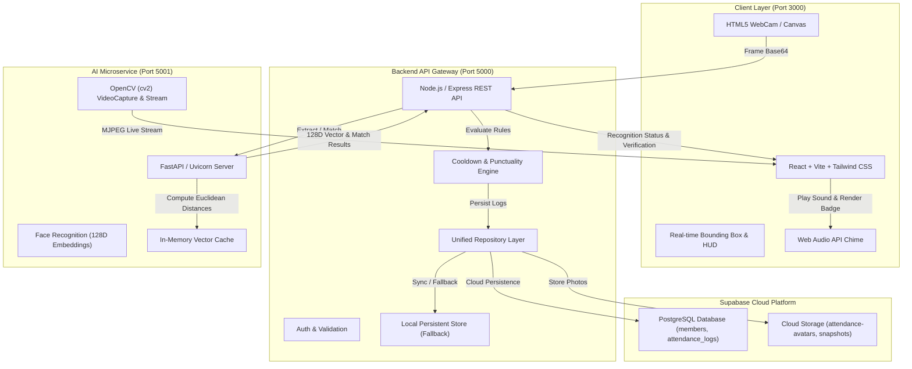

# AuraFace - Real-Time AI Face Recognition Attendance System

An enterprise-grade, real-time facial detection and recognition attendance platform built with **OpenCV** and **dlib face recognition models**, integrated with a high-performance **Node.js/Express REST API** and **Supabase** for PostgreSQL persistence, authentication, and cloud image storage.

Automates daily student and employee logging, enforces punctuality rules, eliminates buddy punching, and reduces manual attendance effort and record errors to zero.

---

## 🌟 Key Features

- **Clean, Minimal & Distraction-Free UI**:
  - Purposefully built with clean typography, soft neutral palette, crisp cards, and restrained accents.
  - Eliminated distracting sci-fi glowing neon lasers or HUD animations in favor of modern, professional educational software design.
- **Three Dedicated Portals (Student, Teacher, Admin)**:
  - **Student Portal**: Personal attendance percentage, punctuality record, today's check-in status, biometric face enrollment status, and personal check-in history.
  - **Teacher / Faculty Portal**: Department classroom attendance overview, student presence roster, one-click manual attendance marking for excused students, and classroom kiosk mode.
  - **Admin Portal**: Institutional command center, school-wide attendance KPIs, student and faculty directory, live camera kiosk, policy configuration (cut-off time, duplicate cooldown, distance tolerance), and full CSV export.
  - **One-Click Role Switcher**: Quick demo login presets for Student, Teacher, and Admin to test any workflow instantly without memorizing credentials.
- **Real-Time Facial Recognition**:
  - 128-dimensional facial metric embedding extraction using deep convolutional neural networks (`dlib` 68-point facial landmark predictor).
  - High-speed Euclidean distance matching with configurable distance tolerance (default `0.52`).
  - Laplacian variance sharpness check to filter out blurry photos and poor lighting.
- **Dual Camera Operating Modes**:
  - **Browser WebCam Kiosk**: HTML5 WebRTC camera scanning with clean focus framing and live detection labels.
  - **OpenCV Native Stream**: 30+ FPS hardware-accelerated MJPEG video stream direct from Python OpenCV engine.
  - **Desktop GUI Kiosk**: Dedicated native window (`live_kiosk.py`) with keyboard shortcuts and auto-API sync.
- **Automated Punctuality & Anti-Duplicate Engine**:
  - Automatic classification of check-ins as **On-Time (Present)** or **Late Arrival** based on configurable cut-off schedules (e.g. `09:15:00`).
  - Cooldown window enforcement (e.g. 5 minutes) to eliminate duplicate logging.
- **Supabase Cloud & Resilient Local Persistence**:
  - PostgreSQL database storage with relational schema, performance indexes, and analytical views.
  - Supabase Cloud Image Storage buckets (`attendance-avatars` and `attendance-snapshots`).
  - Built-in zero-dependency local persistent store fallback so the entire platform operates immediately even before cloud credentials are provided.

---

## 🏛️ System Architecture



---

## 📁 Directory Structure

```
Face Recognition Attendance System/
├── package.json              # Root npm workspace commands
├── start_all.bat             # 1-Click launcher for Windows
├── start_all.ps1             # PowerShell 1-Click launcher
├── supabase_schema.sql       # Complete PostgreSQL schema, RLS, indexes & views
├── .env.example              # Environment variables template
├── README.md                 # System documentation
│
├── python-engine/            # OpenCV & Deep Face Recognition Microservice
│   ├── server.py             # FastAPI server (Port 5001: recognition, cache, MJPEG)
│   ├── face_processor.py     # OpenCV frame decoder, 128D embeddings & distance math
│   ├── live_kiosk.py         # Standalone desktop OpenCV GUI kiosk
│   └── requirements.txt      # Python dependencies
│
├── server/                   # Node.js & Express REST Backend
│   ├── package.json
│   ├── .env                  # Server environment configuration
│   └── src/
│       ├── server.js         # Express app entry (Port 5000)
│       ├── config/           # Supabase client & cloud storage wrapper
│       ├── db/               # Local persistent DB & unified repository
│       ├── controllers/      # Member, Attendance, and Recognition controllers
│       └── routes/           # REST API routes
│
└── client/                   # Modern React Frontend Dashboard & Kiosk
    ├── package.json
    ├── vite.config.js        # Port 3000 with API proxy to port 5000
    ├── tailwind.config.js    # Glassmorphism & scanner animations
    └── src/
        ├── App.jsx           # Main state management & tab router
        ├── components/       # Navbar, AudioChime, EnrollModal, ManualCheckIn
        └── pages/            # Dashboard, LiveKiosk, Members, AttendanceLogs, Settings
```

---

## 🚀 Quick Start Guide

### Prerequisites
- **Node.js** (v18+ recommended, tested on v22.18)
- **Python** (3.10+ recommended, tested on 3.13)
- Real webcam or virtual camera device

---

### Option 1: 1-Click Windows Startup (Recommended)
Double-click `start_all.bat` (or execute `.\start_all.ps1` in PowerShell). This will launch:
1. **Python AI Engine** on `http://localhost:5001`
2. **Node.js Express Server** on `http://localhost:5000`
3. **React Web Kiosk UI** on `http://localhost:3000`

---

### Option 2: Running Services Individually

#### 1. Python Face Recognition Service
```bash
cd python-engine
pip install -r requirements.txt
python server.py
```
*Health Check: `http://localhost:5001/health`*

#### 2. Node.js Express REST API
```bash
cd server
npm install
npm start
```
*API Base: `http://localhost:5000/api`*

#### 3. React Frontend Client
```bash
cd client
npm install
npm run dev
```
*Open your browser at `http://localhost:3000`*

---

## 🗄️ Supabase Cloud Setup

The platform includes a PostgreSQL database schema and storage integration.

1. **Create a Supabase Project** at [https://supabase.com](https://supabase.com).
2. Go to **SQL Editor** in your Supabase Dashboard, paste the contents of [`supabase_schema.sql`](file:///h:/jjk/Face%20Recognition%20Attendance%20System/supabase_schema.sql), and click **Run**.
3. Create two storage buckets under **Storage**:
   - `attendance-avatars` (Public bucket)
   - `attendance-snapshots` (Public bucket)
4. Copy your project credentials into `server/.env`:
   ```env
   SUPABASE_URL=https://your-project-id.supabase.co
   SUPABASE_ANON_KEY=your-anon-key
   SUPABASE_SERVICE_ROLE_KEY=your-service-role-key
   ```
5. Restart the Node.js server. The platform will automatically connect to Supabase PostgreSQL and store avatars and check-in snapshots in the cloud!

---

## 📡 REST API Reference

| Method | Endpoint | Description |
|---|---|---|
| `GET` | `/api/health` | System diagnostics & Supabase connection status |
| `GET` | `/api/members` | List enrolled students & employees with filters |
| `POST` | `/api/members` | Enroll new member (computes 128D embedding) |
| `GET` | `/api/members/:id` | Member profile and individual attendance history |
| `DELETE` | `/api/members/:id` | Delete member and refresh recognition cache |
| `POST` | `/api/attendance/mark` | Record attendance with cooldown & schedule checks |
| `GET` | `/api/attendance/logs` | Query attendance logs with date, role, dept filters |
| `GET` | `/api/attendance/stats` | KPI counters, hourly distribution, dept rates |
| `GET` | `/api/attendance/export` | Download filtered logs as CSV |
| `POST` | `/api/recognition/process-frame` | Detect faces in camera frame & auto-mark |
| `GET` | `/api/recognition/engine-status` | Python service connectivity & camera check |
| `GET` | `/api/settings` | Get current thresholds and cooldown rules |
| `POST` | `/api/settings` | Update recognition tolerance and schedule rules |
| `POST` | `/api/seed` | Reset and seed demo students and attendance logs |

---

## 🖥️ Standalone Desktop OpenCV Kiosk

To run a high-speed desktop kiosk window directly through OpenCV GUI:

```bash
cd python-engine
python live_kiosk.py
```

- Features **60+ FPS native hardware rendering**, real-time face bounding boxes, Windows audio beeps on check-in, and auto-posts attendance to the Node.js REST API.
- Keyboard shortcuts:
  - `q` or `ESC`: Exit kiosk
  - `r`: Reload member cache from database
  - `s`: Save snapshot image to disk

---

## 📄 License
This project is open-source under the MIT License.
