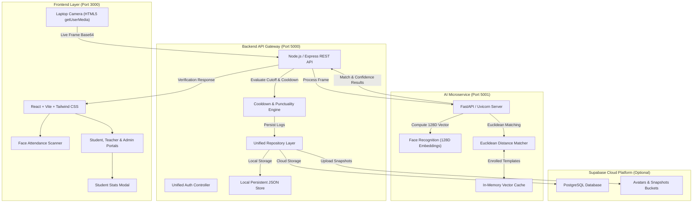

# Real-Time Face Recognition Attendance System

[](https://reactjs.org/)
[](https://vitejs.dev/)
[](https://nodejs.org/)
[](https://fastapi.tiangolo.com/)
[](https://opencv.org/)
[](https://supabase.com/)
[](https://tailwindcss.com/)
[](https://opensource.org/licenses/MIT)

An enterprise-ready, real-time facial recognition attendance platform built with **OpenCV**, **dlib face recognition models**, a high-performance **Node.js/Express REST API**, and **Supabase** for PostgreSQL persistence and cloud storage.

The system automates daily student and faculty attendance, enforces punctuality and cooldown policies, prevents buddy-punching, and eliminates manual attendance logging.

---

## 🌟 Key Features

### 1. Instant Public Face Attendance Scanner
- **Zero-Login Required on Launch**: When opening the platform, it lands directly on the live camera attendance scanner. Students, teachers, and staff simply walk up to the camera, their face is recognized, and attendance is verified and recorded immediately.
- **Laptop Camera Integration**: Prioritizes the laptop's built-in webcam with automatic device enumeration and no background hardware locking.
- **Audio & Visual Feedback**: Plays real-time success or warning audio chimes with on-screen bounding boxes, confidence ratings, and status badges.

### 2. Role-Based Access & Data Scoping
- **Unified Portal Login**: A clean, single login form without confusing role-switch tabs. The system automatically detects whether the user is a Student, Teacher, or Admin upon sign-in.
- **Student Portal**:
  - Personal overall attendance percentage with visual compliance indicator (75% threshold).
  - Punctual on-time count vs. late arrival records.
  - Today's verified check-in status and timestamp.
  - Biometric template enrollment status.
  - Complete personal check-in audit history table.
- **Teacher Portal (Branch-Scoped)**:
  - **Strict Department Scoping**: Teachers only see students enrolled in their own branch/department (e.g. Computer Science teachers only see CS students; Information Technology and other faculty are hidden).
  - Classroom attendance KPI cards (Class Attendance %, Present Today, Absent/Unmarked).
  - Real-time student presence roster with today's status badges (*Present*, *Late*, or *Unmarked*).
  - Manual check-in override limited exclusively to students of their branch.
- **Admin Portal**:
  - Institutional command center with campus-wide statistics, daily trends, and department breakdowns.
  - Campus directory with search and filter capabilities.
  - **Exclusive Enrollment Authority**: Only administrators have permission to register new profiles, capture face photos, and create biometric templates.
  - System policy settings (distance threshold, cut-off time, duplicate cooldown).
  - Filtered CSV report export.

### 3. Interactive Student Statistics Modal
- Teachers and Administrators can click on any student's name, avatar, or the **"View Stats"** button to open an interactive modal displaying:
  - Student photo, roll number, department, semester/batch, and email.
  - Today's check-in status and arrival time.
  - Attendance rate percentage, on-time sessions count, and late arrival count.
  - Biometric 128D facial template status.
  - Detailed historical audit log of every check-in event.

### 4. Minimal, Modern UI
- Purposefully designed with clean typography, soft neutral palette, and structured cards.
- Free of distracting sci-fi glowing neon effects, laser grids, or confusing kiosk terminology.

### 5. Automated Punctuality & Anti-Duplicate Engine
- **Late vs. On-Time Classification**: Automatically evaluates check-in timestamps against a configurable cut-off time (e.g. `09:15:00`).
- **Cooldown Window Enforcement**: Configurable cooldown period (e.g. 5 minutes) to eliminate duplicate scans when a user lingers in front of the camera.

### 6. Dual-Storage Persistence (Supabase + Local JSON Fallback)
- **Supabase Cloud**: PostgreSQL database tables (`members`, `attendance_logs`, `system_settings`) with indexing and Supabase Storage buckets for avatars and check-in snapshots.
- **Local JSON Resilient Fallback**: Zero-configuration local database that works out of the box even before cloud credentials are added.

---

## 🏛️ System Architecture



---

## 📁 Directory Structure

```
Face-Recognition-Attendance-System/
├── package.json              # Root scripts and workspace config
├── start_all.bat             # 1-Click launcher for Windows
├── start_all.ps1             # PowerShell 1-Click launcher
├── supabase_schema.sql       # PostgreSQL schema, tables, indexes & storage policies
├── .env.example              # Environment variables template
├── .gitignore                # Git exclusions (node_modules, builds, caches)
├── README.md                 # System documentation
│
├── python-engine/            # AI & Deep Face Recognition Microservice
│   ├── server.py             # FastAPI server (Port 5001: embedding & recognition)
│   ├── face_processor.py     # 128D feature extraction & Euclidean distance calculation
│   ├── live_kiosk.py         # Standalone desktop OpenCV window
│   └── requirements.txt      # Python dependencies (fastapi, uvicorn, opencv-python, etc.)
│
├── server/                   # Node.js & Express REST Backend
│   ├── package.json
│   ├── src/
│   │   ├── server.js         # Express app entry point (Port 5000)
│   │   ├── config/           # Supabase client & storage configuration
│   │   ├── db/               # Local JSON store & unified repository layer
│   │   ├── controllers/      # Member, Attendance, and Recognition controllers
│   │   └── routes/           # REST API route handlers
│   └── data/                 # Local persistent database storage
│
└── client/                   # React Frontend Application
    ├── package.json
    ├── vite.config.js        # Port 3000 config with proxy to backend
    ├── tailwind.config.js    # Styling & design system
    └── src/
        ├── App.jsx           # Main state management & view routing
        ├── components/       # Navbar, AudioChime, EnrollModal, ManualCheckInModal, StudentStatsModal
        └── pages/            # LiveKiosk, Dashboard, Members, AttendanceLogs, Settings, StudentPortal, TeacherPortal, Login
```

---

## 🚀 Quick Start Guide

### Prerequisites
- **Node.js** (v18 or higher)
- **Python** (v3.10 or higher)
- Built-in laptop webcam or USB camera

---

### Option 1: 1-Click Windows Startup (Recommended)
Double-click `start_all.bat` (or run `.\start_all.ps1` in PowerShell). This automatically starts:
1. **Python AI Engine** on `http://localhost:5001`
2. **Node.js Express Server** on `http://localhost:5000`
3. **React Client** on `http://localhost:3000`

---

### Option 2: Running Services Individually

#### 1. Python Face Recognition Microservice
```bash
cd python-engine
pip install -r requirements.txt
python server.py
```
*Health Check: `http://localhost:5001/health`*

#### 2. Node.js Express REST API
```bash
cd server
npm install
npm run dev
```
*API Root: `http://localhost:5000/api`*

#### 3. React Frontend Client
```bash
cd client
npm install
npm run dev
```
*Open your browser at `http://localhost:3000`*

---

## 👥 Demo Accounts

The local database comes pre-seeded with sample profiles across all three roles:

| Role | Email | Password | Department | Permissions |
|---|---|---|---|---|
| **Admin** | `admin@school.edu` | `admin123` | Administration | Full access, enroll members, system settings, all logs |
| **Teacher** | `teacher@school.edu` | `teacher123` | Computer Science | Computer Science students only, class roster, manual check-in |
| **Student** | `student@school.edu` | `student123` | Computer Science | Personal attendance stats, today's status, personal history |

---

## 🗄️ Supabase Cloud Setup (Optional)

The platform runs out of the box using local persistent storage. To connect your Supabase PostgreSQL cloud database:

1. **Create a Supabase Project** at [https://supabase.com](https://supabase.com).
2. Go to **SQL Editor** in your Supabase Dashboard, paste the contents of [`supabase_schema.sql`](supabase_schema.sql), and click **Run**.
3. Create two storage buckets under **Storage**:
   - `attendance-avatars` (Public bucket)
   - `attendance-snapshots` (Public bucket)
4. Add your project credentials into `server/.env`:
   ```env
   SUPABASE_URL=https://your-project-id.supabase.co
   SUPABASE_ANON_KEY=your-anon-key
   SUPABASE_SERVICE_ROLE_KEY=your-service-role-key
   ```
5. Restart the Node.js server. The platform will automatically connect to Supabase PostgreSQL and store avatars and check-in snapshots in the cloud.

---

## 📡 REST API Reference

| Method | Endpoint | Description |
|---|---|---|
| `GET` | `/api/health` | System health and Supabase connection diagnostic |
| `POST` | `/api/auth/login` | Unified authentication (returns user profile & token) |
| `GET` | `/api/members` | Get member list with `role`, `department`, and `search` filters |
| `GET` | `/api/members/:id` | Get individual profile and attendance history |
| `POST` | `/api/members` | Enroll new profile (computes 128D facial template) |
| `DELETE` | `/api/members/:id` | Remove profile and invalidate in-memory cache |
| `POST` | `/api/attendance/mark` | Record check-in with cooldown & late cut-off checks |
| `GET` | `/api/attendance/logs` | Fetch attendance logs with `date`, `role`, `department`, and `status` filters |
| `GET` | `/api/attendance/stats` | KPI summary (present count, late count, rates) |
| `GET` | `/api/attendance/export` | Export filtered attendance logs as CSV file |
| `POST` | `/api/recognition/process-frame` | Real-time face detection & auto-attendance on camera frames |
| `GET` | `/api/recognition/engine-status`| Python microservice connectivity check |
| `GET` | `/api/settings` | Read current policy configuration |
| `POST` | `/api/settings` | Update cut-off time, duplicate cooldown, and tolerance |

---

## 📄 License

This project is licensed under the [MIT License](LICENSE).
